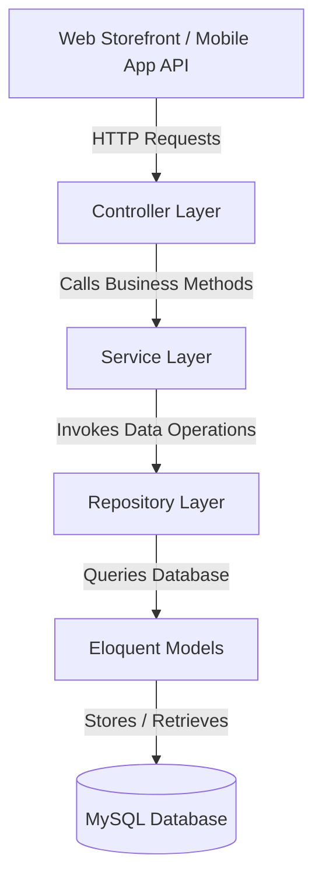

# UdenShop - Premium E-Commerce Platform

UdenShop is a modern, high-performance, and feature-rich B2C/C2C E-Commerce platform built with **Laravel 12**, **PHP 8.2+**, **MySQL**, and **Tailwind CSS**. It follows clean code architecture principles, implementing the **Repository Pattern** and **Service Layer** to separate data access, business logic, and presentation.

---

## 🌟 Key Features

### 🛒 Storefront
- **Responsive Layout**: Mobile-first design featuring modern glassmorphism aesthetics and active Dark/Light mode.
- **Product Filtering & Search**: Real-time filtering by category, brand, price range, and search query on the Shop page.
- **Product Variants & Multi-Images**: Support for physical/digital products, bundle listings, and multi-image galleries.
- **Interactive Shopping Cart**: Add, update, and remove products dynamically; coupon code application with active discount logic.
- **Multi-Address Checkout**: Multi-step checkout with courier selection (mock RajaOngkir calculations) and payment options.
- **Wishlist & Product Reviews**: Add products to personal wishlists and submit/read detailed customer reviews (with 1-5 star ratings).
- **Referral & Loyalty Program**: Automatic referral commissions for Affiliates and points balance accumulation for Customers.

### 👑 Premium Admin Dashboard
- **Analytics & Sales Charts**: Visually rich dashboard depicting sales, profits, orders, and customer registrations.
- **CRUD Management**: Manage Products (with multi-image upload), Categories, and Brands from a centralized interface.
- **Order Tracking**: Handle order lifecycle transitions (Pending ➡️ Paid ➡️ Processing ➡️ Shipped ➡️ Completed ➡️ Cancelled).
- **Sales Reports**: View and track overall profitability and system margins.

### 📱 Rest API Module
- Fully integrated REST API protected by **Laravel Sanctum**.
- Ready-to-use endpoints for Mobile App integration (Authentication, Products, Categories, Cart, Wishlist, Reviews, and Checkout).

---

## 🛠️ Architecture Design



### Repository Pattern
Data retrieval is abstracted through Repository contracts:
- `ProductRepositoryInterface` / `ProductRepository`
- `OrderRepositoryInterface` / `OrderRepository`
- `CartRepositoryInterface` / `CartRepository`
- `UserRepositoryInterface` / `UserRepository`

### Service Layer
Key business operations are centralized in single-responsibility Service classes:
- `ProductService`: Manages product query filters, inventory checks, and stock management.
- `CartService`: Manages cart creation, items modification, and voucher/coupon validation.
- `CheckoutService`: Processes checkout calculations, creates orders, updates stock, and triggers payment setups.
- `ShippingService`: rajaOngkir mock API connector calculating weight-based shipping rates.
- `PaymentService`: Integrates payment gateways (mock Midtrans transaction handlers).
- `LoyaltyService`: Manages point gains based on purchases.
- `AffiliateService`: Assigns sales commissions to referring users.

---

## 🚀 Installation & Setup Guide

Follow these steps to set up UdenShop on your local machine (configured for XAMPP / Windows):

### 1. Prerequisites
- **XAMPP** (PHP 8.2+, MySQL 8+)
- **Composer** (Or run via local `composer.phar`)

### 2. Clone and Configure
1. Clone the repository into your webroot directory (e.g. `C:\xampp\htdocs\udenshop`).
2. Copy the `.env.example` file to `.env`:
   ```bash
   copy .env.example .env
   ```
3. Update database credentials in `.env`:
   ```env
   DB_CONNECTION=mysql
   DB_HOST=127.0.0.1
   DB_PORT=3306
   DB_DATABASE=udenshop
   DB_USERNAME=root
   DB_PASSWORD=
   ```

### 3. Install Backend Dependencies
Run composer to install package dependencies:
```bash
c:\xampp\php\php.exe composer.phar install
```

### 4. Set Up Application & Database
Generate the application encryption key, set up the tables, and seed the dummy data:
```bash
c:\xampp\php\php.exe artisan key:generate
c:\xampp\php\php.exe artisan migrate --seed
```

### 5. Start the Application
Make sure MySQL is running in your XAMPP Control Panel. Start the local server:
```bash
c:\xampp\php\php.exe artisan serve
```
Access the application at `http://127.0.0.1:8000`.

---

## 👥 Demo User Accounts

The database seeders generate mock accounts for testing out roles and features:

| Role | Email | Password |
| :--- | :--- | :--- |
| **Super Admin** | `admin@udenshop.com` | `password` |
| **Admin** | `staff@udenshop.com` | `password` |
| **Customer** | `customer@udenshop.com` | `password` |
| **Affiliate User** | `affiliate@udenshop.com` | `password` |

---

## 🧪 Testing

UdenShop includes a full feature and integration test suite to verify routing, auth state, and the REST API.

To run the automated tests:
```bash
c:\xampp\php\php.exe artisan test
```

---

## 📡 REST API Documentation

All API routes are prefixed with `/api` and return standardized JSON responses:
`{ "status": "success", "message": "...", "data": [...] }`

### 🔑 Authentication Endpoints
- `POST /api/register` - Create new customer account.
- `POST /api/login` - Authenticate user and receive Sanctum Bearer token.
- `POST /api/logout` - Revoke current Sanctum token (Protected).
- `GET /api/user` - Retrieve authenticated user info (Protected).

### 🏷️ Product & Catalog Endpoints
- `GET /api/products` - List active products (supports `?category=slug` and `?search=query` filters).
- `GET /api/products/{slug}` - Fetch product details (includes related products and reviews).
- `GET /api/categories` - List all parent categories and subcategories.
- `GET /api/categories/{slug}` - Fetch single category info.

### 🛒 Shopping Cart Endpoints
- `GET /api/cart` - Retrieve cart state & calculated totals (subtotal, weight, discount, grand total).
- `POST /api/cart/add` - Add product item to cart (params: `product_id`, `quantity`, `options[]`).
- `PUT /api/cart/update/{itemId}` - Update item quantity in cart.
- `DELETE /api/cart/remove/{itemId}` - Remove item from cart.
- `POST /api/cart/coupon/apply` - Apply a coupon code (`coupon_code`).
- `POST /api/cart/coupon/remove` - Remove currently applied coupon.

### 🚚 Shipping & Location Endpoints
- `GET /api/shipping/provinces` - Fetch Indonesian provinces.
- `GET /api/shipping/provinces/{provinceId}/cities` - Fetch cities in a province.
- `POST /api/shipping/calculate` - Estimate shipping costs (params: `destination_city_id`, `courier`).

### 🔒 Checkout, Wishlist, & Review Endpoints (Authenticated)
- `POST /api/checkout/process` - Complete order checkout (params: shipping details, payment gateway choice).
- `POST /api/products/{productId}/reviews` - Submit review rating and comments.
- `GET /api/wishlist` - List active wishlist items.
- `POST /api/wishlist` - Add product to wishlist.
- `DELETE /api/wishlist/{productId}` - Remove product from wishlist.
